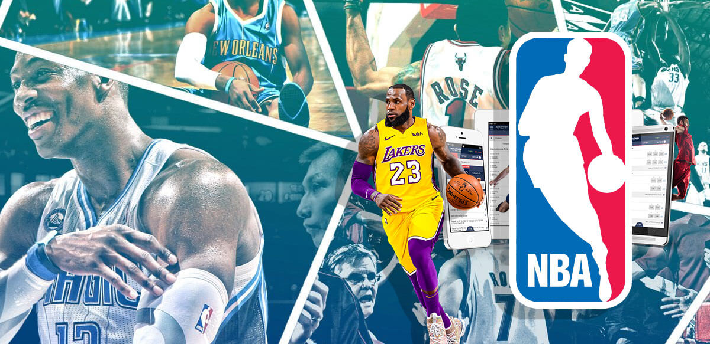

# NBA Stats App

<p align="center">
	
</p>

<p align="center">
	<a href="#"></a>
	<a href="#"></a>
	<a href="#"></a>
	<a href="#"></a>
	<a href="#"></a>
	<a href="https://opensource.org/license/isc-license-txt"></a>
	<a href="https://render.com/"></a>
</p>

A full-stack NBA tracker where users can browse teams and players, view injury and player details, and save favorite players.

## Highlights

- Browse NBA teams and player information.
- View details such as championships, key player stats, and team records.
- Search and track data quickly from the UI.
- Save favorite players for quick access.
- Server-rendered pages with EJS for a fast, simple UX.

## Tech Stack

- Node.js
- Express.js
- MongoDB + Mongoose
- EJS
- Tailwind CSS
- Vanilla JavaScript

## Project Structure

```text
config/        Database connection setup
controllers/   Route controller logic
models/        Mongoose models
public/        Static assets (CSS, JS, images)
routes/        Express route definitions
views/         EJS templates and partials
server.js      App entry point
```

## Getting Started

### 1. Clone and install

```bash
git clone <repository-url>
cd nba-stats-app
npm install
```

### 2. Create environment variables

Create a `.env` file in the project root:

```env
DB_STRING=<your-mongodb-connection-string>
```

### 3. Run the app

```bash
npm start
```

For development with auto-reload:

```bash
npm run dev
```

Open http://localhost:2121 in your browser.

## Available Scripts

- `npm start` - Start the server
- `npm run dev` - Start with nodemon
- `npm run build:css` - Build/watch Tailwind output

## Contributing

Contributions are welcome.

1. Fork the repository.
2. Create a feature branch.
3. Commit your changes.
4. Open a pull request.
